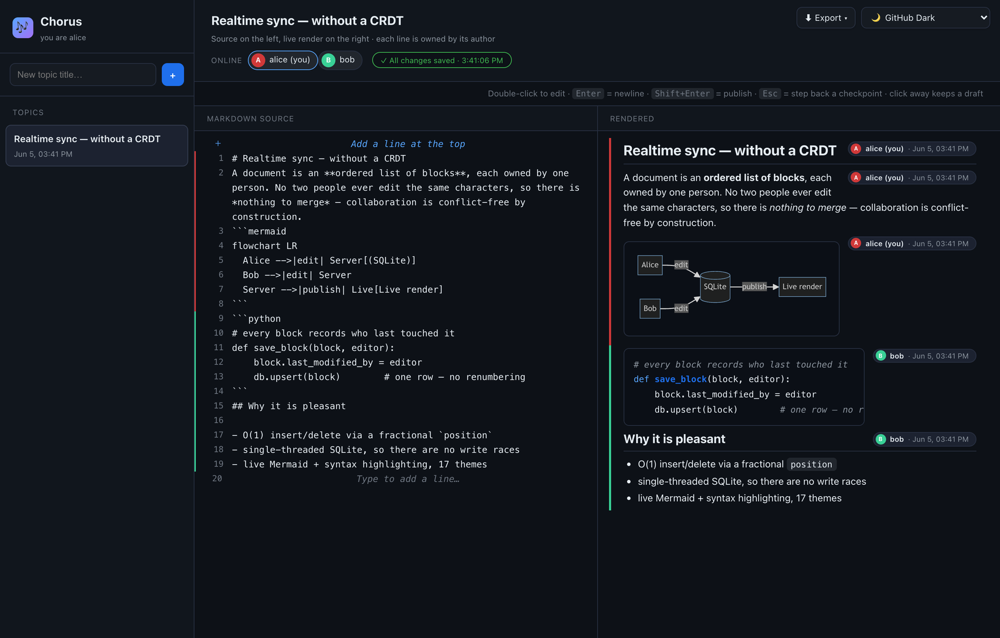
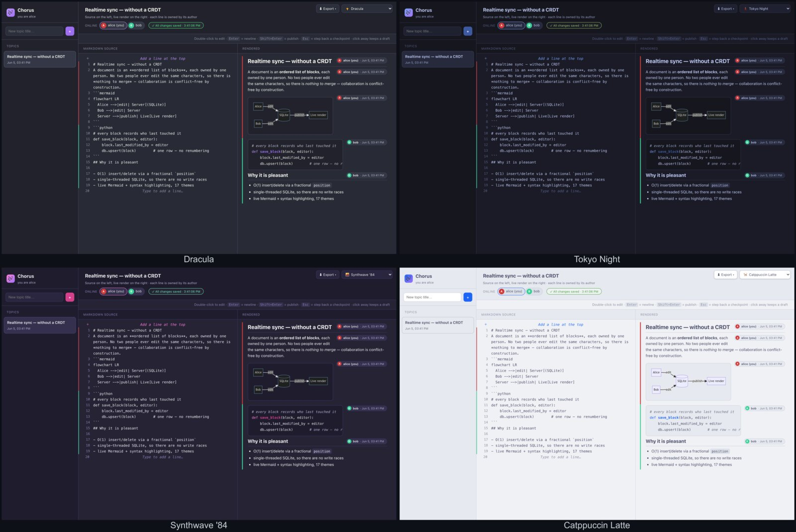

# Chorus — developer & operations guide

The full reference for [Chorus](README.md): features, architecture, configuration,
the HTTP API, production hardening, and tests. For a quick start (Docker or source),
see the [README](README.md).



## Features

- **Login by default** — the server requires a sign-in. Start it and it prints a
  `admin` username and a random password to the console (or set your own with
  `CHORUS_USER` / `CHORUS_PASSWORD`); run with `--no-auth` for an open, no-login
  sandbox. Access is gated on both the REST API and the realtime socket via a
  per-boot token.
- **Display-name identity** — after signing in, pick a display name; it's saved to
  `localStorage` and attributes every block you add.
- **Version history** — every publish records a revision (de-duped, capped at 30
  per block). Hover a block and click **⟲** to browse its published versions and
  restore any of them — the restored text becomes *your draft*, so nothing goes
  live until you Shift+Enter.
- **Topics** — anyone can create one; they appear instantly in everyone's
  sidebar. The row's **⋯** menu renames or deletes a topic for everyone
  (deletion cascades to its blocks and their history, and is refused while
  someone else is mid-edit inside it).
- **Side-by-side source & render** — two panes: a **line-numbered code editor on
  the left**, the **live rendered document on the right** (scroll-synced). The
  left is one continuous document: **double-click a line to edit it inline**,
  press **Enter** for a new line, **Shift+Enter** to publish, and clear a line to
  delete it. Anyone may edit any line — but a line someone is editing is locked
  until they publish. The right pane is the rendered, attributed result for the
  whole topic.
- **Continuous render + attribution chip** — the right pane reads as one Markdown
  document. Ownership shows as a colored left bar, with a small author + timestamp
  chip **floated to the top-right** of each block (the text wraps around it, so it
  never breaks onto its own line).
- **EDITING / PUBLISHED state with a "modifying" overlay** — each block has an
  authoritative `state` in the DB. The moment you put your cursor on a block it's
  `editing`, and peers see a spinner overlay — "**_<you> is modifying…_**" — over
  that block (the last-published content stays visible underneath; your in-progress
  text is **never sent to peers**). You compose freely (**Enter = newline** inside
  the block) and **Shift+Enter publishes** (`state → published`), which is when
  everyone else re-renders it. **Switching focus never publishes** — click away or
  tab out and the block stays a saved **draft** (marked with a dashed amber border
  and a `draft ⇧⏎` hint), so you can't broadcast half-written content by accident.
  Publishing is always a deliberate Shift+Enter. While editing, **`Esc` steps back
  one checkpoint at a time** — the draft is snapshotted at every auto-save (de-duped),
  so the first `Esc` drops edits made since the last save, each further `Esc` walks
  back through the saved snapshots, and a final `Esc` at the starting point cancels
  the edit (reverting an existing block to its last-published text, or removing a
  brand-new one). You always see your own live render (with real Markdown/Mermaid
  syntax errors). If you disconnect mid-edit and don't come back within a short
  grace window, the server publishes your draft so no one is stuck behind the
  overlay — a brief network blip keeps your edit (and its lock) intact.
- **One shared document, owned by blocks** — the document is ordered paragraphs
  ("blocks"). While editing a line, press **Enter** to start a new line below (and
  jump to it), **Shift+Enter** for a line break within the line. **Enter inside a
  ` ```fence `** stays a normal newline, so multi-line code/Mermaid isn't split.
  You can also click the `＋` at the start (left edge) of any line to insert below;
  an empty topic shows a one-click **＋ Add a line** prompt. Lines left empty are
  dropped automatically.
- **Anyone can edit any block, with a server-enforced lock** — **double-click**
  any block to edit it. While you're editing, that block is locked **on the
  server**: any write or delete for it from another identity is rejected with an
  explicit error, and others see an overlay ("_<you> is cooking…_", with a
  randomized fun verb) until you publish. So there's only ever one editor per
  block at a time — collision-free by construction, without a CRDT — and each
  block records **`last_modified_by`** (the chip + color follow whoever last
  touched it).
- **Robust live rendering** — incomplete Markdown/Mermaid never breaks the view:
  diagrams are pre-validated, last-good renders are cached to avoid flicker, and
  a **spinner** marks a block (and any half-written diagram) while it's being
  worked on — no error flashes mid-edit.
- **Syntax highlighting** — fenced code blocks (` ```python `, ` ```bash `, …) are
  highlighted with [highlight.js](https://highlightjs.org/), themed via the same
  CSS variables so every color theme is covered. ` ```mermaid ` fences still render
  as diagrams, not code.
- **Presence** — a per-topic online-users list plus a live "_X is editing…_"
  indicator and per-block working spinners.
- **Real-time sync via Socket.io** — `topic:created`, `user:join`,
  `users:update`, `block:update`, and `block:delete` events keep every client in
  lockstep. Live events that arrive while a topic is still loading are **buffered
  and replayed** after the initial snapshot (no lost blocks), and updates are
  applied **monotonically by timestamp** so out-of-order delivery can't regress a
  block.
- **Auto-saved drafts, honestly reported** — while you edit, the draft is
  persisted to the server on a periodic cycle (every 5s); the header bar shows the
  last save time and a countdown to the next, and it only says **saved** once the
  server has acknowledged the write — if you're offline or a write is rejected,
  it says that instead. A disconnect mid-edit publishes your last saved draft
  after a short grace window.
- **Persistent** — blocks are stored in SQLite (`better-sqlite3`) with a
  fractional `position` for ordering; the whole document is restored on page load.
- **Export** — a top-right **Export** menu downloads the topic as a raw
  **`.md`** file (the canonical server-assembled Markdown) or opens a clean,
  light **print-to-PDF** view of the rendered document (diagrams included).
- **Themes** — a top-right dropdown switches between **18 preset color themes**
  grouped by Dark / Light (GitHub Dark · Dimmed · Light, Dracula, Nord, One Dark,
  Monokai, Tokyo Night, Catppuccin Mocha · Latte, Gruvbox Dark · Light, Rosé Pine,
  Solarized Dark · Light, Synthwave '84, Ayu Mirage, and **The Matrix** — green
  phosphor on black, monospace everything). Every theme is just a set of CSS
  variables, so the whole UI — including code highlighting — recolors instantly;
  the choice is saved to `localStorage` and Mermaid diagrams re-render to match.

### 18 built-in themes

The whole UI — chrome, code highlighting, and Mermaid diagrams — recolors instantly.



## How it works (the idea)

Real-time collaborative editors usually reach for a **CRDT or OT** engine to merge
concurrent edits to the same text. Chorus sidesteps that entirely with one rule:

> **A document is an ordered list of blocks, and each block has exactly one
> editor at a time. Anyone may edit any block — but never simultaneously.**

Because no two people ever edit the same characters at the same time, **there's
nothing to merge** — edits can't conflict by construction. That makes the whole
sync layer simple:

- **Identity** is a stable per-browser `owner_id` (not the display name), bound
  to the socket **at the handshake** — event payloads can't impersonate anyone,
  and renaming yourself keeps your attribution.
- **The editing lock is enforced on the server**: the moment you start editing a
  block it's locked to your identity; updates, publishes, and deletes from anyone
  else are rejected (with a `locked` ack) until you publish or leave. A network
  blip doesn't lose the lock — the server holds a grace window for the same
  identity to reconnect before it force-publishes the draft.
- **Every write is acknowledged.** A write that's rejected (block locked, topic
  full, content truncated) comes back in the ack, and the client's save bar says
  so — the UI never claims "saved" for a write the server refused.
- **Drafts are withheld server-side**: a block mid-edit returns empty content via
  the REST API and is excluded from the Markdown export until published — peers
  can't read your half-typed thoughts even with `curl`.
- **Ordering** uses a fractional `position` (insert between `a` and `b` at
  `(a+b)/2`), so inserting/deleting a line is a single-row op with **no
  renumbering**.
- **Concurrency** is safe because the server is single-threaded with synchronous
  SQLite writes (no check-then-write race), block ids are client-generated UUIDs,
  and updates apply **monotonically by timestamp**. Events that land mid-load are
  buffered and replayed.
- **Live feel**: while you type, *you* see your own render (with real Markdown/
  Mermaid syntax errors); *others* see "_… is typing_" until you move off the line.

The trade-off: it's collaborative *per block*, not *per character* — great for
discussions, design docs, and shared scratchpads; not a Google-Docs replacement.

## Stack

| Layer     | Tech                                            |
| --------- | ----------------------------------------------- |
| Backend   | Node.js · Express · Socket.io                   |
| Database  | SQLite via `better-sqlite3`                      |
| Frontend  | Vanilla JS in a single HTML file (inline CSS/JS) |
| Markdown  | `markdown-it` + `highlight.js` + `mermaid.js` (vendored in `public/vendor/`, served same-origin — no runtime CDN) |

## Configuration

Everything is configured through environment variables (see `.env.example`). On
Node 20.6+ you can load a file with `node --env-file=.env server.js`.

| Variable | Default | Purpose |
| --- | --- | --- |
| `CHORUS_USER` | `admin` | Login username |
| `CHORUS_PASSWORD` | _(random, printed on boot)_ | Login password |
| `CHORUS_NO_AUTH` | _(unset)_ | Set to `1` to disable login (open sandbox) |
| `PORT` | `3000` | Port to listen on (`--port` also works) |
| `HOST` | `127.0.0.1` | Bind address; `0.0.0.0` for LAN/tunnel/container (`--host`) |
| `TRUST_PROXY` | _(off)_ | Behind a proxy, set to `1`/hop-count/`true` so the rate-limiter sees the real client IP |
| `CHORUS_DB` | `./chorus.db` | SQLite file path |
| `MAX_TOPICS` | `300` | Cap on total topics |
| `MAX_BLOCKS_PER_TOPIC` | `1000` | Cap on blocks per topic |
| `MAX_SOCKETS_PER_IP` | `20` | Cap on concurrent realtime connections per IP |
| `EDIT_GRACE_MS` | `8000` | How long a disconnected editor may reconnect before their draft is auto-published |

## Login & access control

Login is **on by default**, gating both the REST API and the realtime socket.

- **Set your own credentials** (recommended for anything real):
  ```bash
  CHORUS_USER=team CHORUS_PASSWORD='a-good-passphrase' node server.js
  # or: node server.js --user=team --password='a-good-passphrase'
  ```
- **Auto-generated** — if you don't set a password, the server creates a random
  one and prints it (username defaults to `admin`). It changes on every restart.
- **Disable login** for an open sandbox: `node server.js --no-auth` (or
  `CHORUS_NO_AUTH=1`). Anyone who can reach the URL can then read and write.

How it works: the credentials are exchanged once (`POST /api/login`) for a random
per-boot **token** that the browser stores in `localStorage` and presents on every
request and socket connection. Restarting the server rotates the token, so everyone
is signed out. There are no user accounts — it's a single shared login.

## Data & persistence

All topics and blocks are stored in a SQLite file — **`chorus.db`, next to
`server.js`** — created automatically on first run. The path is tied to the
file's location, **not** the port or your current directory, so restarting on a
different port keeps all your data. The server prints the exact path on boot
(`Data: …/chorus.db`).

- To use a different file (e.g. for a throwaway/test run), set `CHORUS_DB`:
  ```bash
  CHORUS_DB=/tmp/scratch.db node server.js
  ```
- Writes go to a write-ahead log (`chorus.db-wal`) first; the server folds it
  back into `chorus.db` **every ~15s** and again on a clean `Ctrl+C`. Writes are
  synchronous, so even a hard `kill -9` loses nothing (the WAL replays on the
  next start); only power loss / OS crash can cost the last few seconds.

### Backups

Use the built-in snapshot — it's produced with SQLite's `VACUUM INTO`, which is
always consistent even under live writes (a plain `cp` of a live `chorus.db`
can race a checkpoint and produce a torn, unusable copy):

- **From the UI**: Export menu → *Backup all data (.db)* — downloads every topic.
- **From the shell**:
  ```bash
  curl -H "Authorization: Bearer <token>" -o backup.db http://localhost:3000/api/backup
  ```
- **Restore**: stop the server, replace `chorus.db` with the backup (delete any
  leftover `chorus.db-wal`/`-shm`), start the server.

To reset, delete `chorus.db` while the server is **stopped** (deleting it while
running orphans the live data and you'll get a fresh, empty DB on next start).

## Host & port options

By default the server binds to `127.0.0.1` (localhost only). Override the host
and port via CLI flags or environment variables:

```bash
# Custom port
node server.js --port=4000          # or: PORT=4000 node server.js

# Listen on all interfaces — needed for LAN access or a tunnel (ngrok, cloudflared, …)
node server.js --host=0.0.0.0       # or: HOST=0.0.0.0 node server.js

# Combine them
node server.js --host=0.0.0.0 --port=4000
```

Both `--flag=value` and `--flag value` forms work.

**Exposing it through a tunnel:** start with `--host=0.0.0.0`, then point your
tunnel at the same port, e.g.:

```bash
node server.js --host=0.0.0.0 --port=3000
ngrok http 3000          # or: cloudflared tunnel --url http://localhost:3000
```

> ⚠️ `--host=0.0.0.0` makes Chorus reachable by anyone who can hit your machine /
> tunnel URL. The default login gates access — set a strong `CHORUS_PASSWORD`
> before exposing it, and only share the credentials with people you trust. (If
> you run with `--no-auth`, there's nothing stopping anyone with the URL.)

## HTTP API

Read-only JSON endpoints (all state changes happen over Socket.io). When login is
enabled (the default), the data endpoints require an `Authorization: Bearer <token>`
header — get a token from `POST /api/login` with `{ "username", "password" }`.

| Endpoint | Returns |
| --- | --- |
| `GET /healthz` | Liveness/readiness probe: `{ ok: true, uptime }` (no auth needed) |
| `GET /api/auth` | Whether login is required: `{ required: true\|false }` (no auth needed) |
| `POST /api/login` | `{ token }` for valid `{ username, password }`; `401` otherwise (no auth needed) |
| `GET /api/topics` | All topics: `[{ id, title, created_at }]` |
| `GET /api/topics/:id/blocks` | The topic's blocks in reading order: `[{ id, owner_id, author, content, position, created_at, updated_at }]` (mid-edit blocks have their content withheld) |
| `GET /api/topics/:id/document` | The whole document in one shot (see below) |
| `GET /api/blocks/:id/revisions` | The block's published history, newest first: `[{ id, content, author, created_at }]` (drafts are never recorded; capped at 30/block) |
| `GET /api/backup` | A consistent SQLite snapshot of the entire database (`VACUUM INTO`) as a download |

`GET /api/topics/:id/document` returns the canonical document — topic metadata, the
ordered owned blocks, and the assembled Markdown:

```json
{
  "id": 1,
  "title": "Auth Flow",
  "created_at": "2026-06-04T…",
  "blocks": [
    { "id": "b-…", "owner_id": "u-…", "author": "alice", "content": "# Auth Flow", "position": 1, "updated_at": "…" }
  ],
  "markdown": "# Auth Flow\n\n## Notes from bob\n\n```mermaid\n…\n```"
}
```

The `markdown` field joins the blocks in order — handy for exporting or copying the
whole topic as one Markdown file. Unknown topics return `404`.

## Running in production

Chorus is a single long-lived Node process; run it under a supervisor (systemd,
Docker, a PaaS) and put TLS in front of it. It's hardened for that:

- **Auth on by default** — set a strong `CHORUS_PASSWORD`; the token gates both the
  REST API and the WebSocket.
- **Security headers** — `Content-Security-Policy` fully same-origin (every
  library is vendored; `connect-src` is pinned to the request's own host),
  `X-Content-Type-Options`, `X-Frame-Options`, `Referrer-Policy`; `x-powered-by`
  is off and untrusted Mermaid diagrams render in `strict` mode (no script injection).
- **Rate limits** — login throttle (per-IP, brute-force), an `/api` read limit
  (per-IP), per-socket write limits, and a per-IP concurrent-connection cap.
- **Health probe** — `GET /healthz` for your load balancer / uptime check (the
  Docker image wires up a `HEALTHCHECK`).
- **Resilient** — every socket handler is sandboxed, every write is acknowledged
  to the client, unhandled errors are logged and the DB is checkpointed before
  exit, and the WAL is folded into `chorus.db` every 15 s.
- **Behind a proxy** — set `TRUST_PROXY` so the rate limits key on the real
  client IP, and terminate TLS at the proxy (the token + login travel over it).
- **Tests/CI** — `npm test` runs an end-to-end suite; CI runs it on Node 20/22/24.

**Checklist:** set `CHORUS_PASSWORD` ·  put it behind HTTPS ·  set `TRUST_PROXY` if
proxied ·  mount `CHORUS_DB` on a persistent volume ·  point monitoring at `/healthz`.

## Deploying a public demo

Chorus is a long-lived Node process with **WebSockets + a local SQLite file**, so
it wants a persistent-process host (a container/VM), **not** serverless/edge.

A `Dockerfile` is included. It listens on `0.0.0.0`, reads `PORT` from the host,
and stores the DB at `CHORUS_DB=/data/chorus.db` (mount a volume at `/data` to keep
data across restarts).

```bash
# published image (multi-arch, pushed on every release)
docker run -p 3000:3000 -v chorus-data:/data ghcr.io/codemk8/chorus:latest

# …or build it yourself
docker build -t chorus .
docker run -p 3000:3000 -v chorus-data:/data chorus
```

A multi-arch image (`linux/amd64` + `linux/arm64`) is built and pushed to
`ghcr.io/codemk8/chorus` whenever you publish a GitHub Release or push a `v*` tag —
see [`.github/workflows/docker-publish.yml`](.github/workflows/docker-publish.yml).
Tags follow the release version (`1.2.3`, `1.2`); `latest` tracks full releases only.

**Volume permissions**: the container starts as root just long enough for its
entrypoint to `chown /data` to the runtime user, then drops to `node` — so
bind mounts (`-v $PWD/data:/data`) and platform volumes (Fly.io & co., which
arrive root-owned) work out of the box. If you run with `--user`, make sure the
mounted directory is writable by that uid.

Free-ish hosts:

- **Fly.io** — WebSockets + a small persistent volume; low usage is effectively
  free. `fly launch` (Dockerfile detected) → add a volume mounted at `/data`.
- **Render** (free web service) — one click from the repo, but it **sleeps when
  idle** and its free disk is **ephemeral**, so the DB resets on restart/redeploy.
  For a demo that auto-reset is arguably a feature (it clears spam).

> **GitHub Pages can't host it** — Pages is static-only and Chorus needs a live
> server. GitHub hosts the code; the demo runs on one of the above.

**Demo guardrails** (already built in, tunable via env): the default **login**
(set `CHORUS_PASSWORD`, or `--no-auth` for an open demo), per-socket rate limits on
all socket events, per-IP API and connection limits, a payload cap, `MAX_TOPICS`
(default 300), and `MAX_BLOCKS_PER_TOPIC` (default 1000). There's a single shared
login and **no per-user accounts or moderation**, so for a public demo either set a
password you're willing to share or treat `--no-auth` as an open, disposable sandbox.

## Tests

`npm test` runs an end-to-end suite (`node --test`) that spawns the real server with
a throwaway DB and a known password, then exercises the HTTP API, auth gating, the
security headers, and the realtime invariants: draft withholding (socket + REST),
server-side editing locks, acknowledged writes at every cap, the login throttle,
the backup endpoint, the per-IP connection cap, and the disconnect-grace /
reconnect re-claim flow.

`npm run test:browser` drives the real frontend in headless Chrome (skips when no
Chrome is installed; set `CHROME_PATH` to override detection) and covers the UX
invariants: publish flow + lock overlay, draft-on-blur, the Esc checkpoint stack,
reconnect re-sync (idle and deferred-while-editing), and multi-tab sync.

CI runs both on every push/PR — the server suite on Node 20, 22, and 24, the
browser suite on the runner's Chrome (`.github/workflows/ci.yml`).

## Project structure

```
chorus/
├── package.json
├── server.js              # All backend logic: Express + Socket.io + SQLite
├── public/
│   └── index.html         # Entire frontend: inline CSS + JS
├── test/
│   ├── server.test.js     # End-to-end API/realtime tests — `npm test`
│   └── browser.test.js    # Headless-Chrome UX tests — `npm run test:browser`
├── .github/workflows/ci.yml  # CI: server suite on Node 20/22/24 + browser suite
├── .env.example           # Documented configuration
├── Dockerfile             # Hardened container image (drops to non-root + healthcheck)
├── docker-entrypoint.sh   # Fixes /data volume ownership, then drops privileges
├── README.md              # Quick start (this file's companion)
├── DEVELOPER.md           # You are here
└── LICENSE
```

## License

MIT
